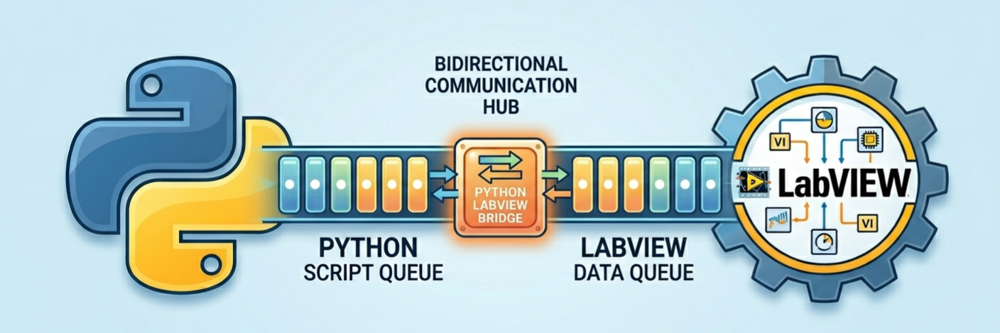
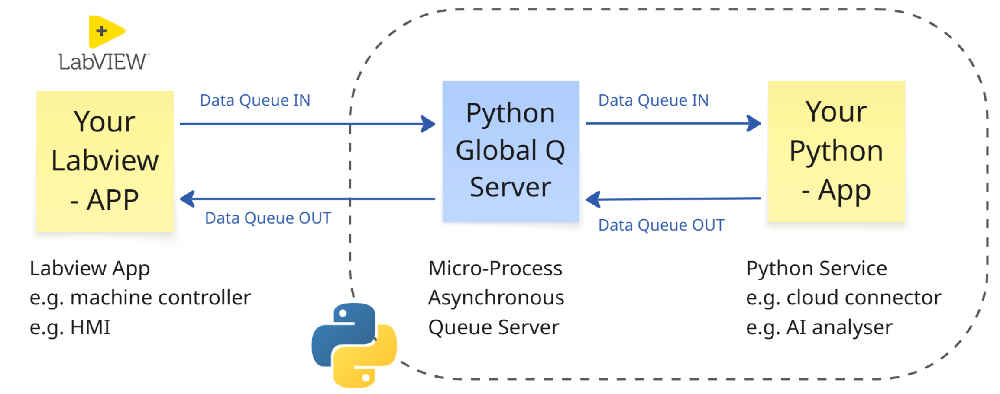

# Labview Python Bridge
Connect labview apps with python apps in realtime with multi-processing data queues.



brought to you by [Awaken IoT](https://awakeniot.com/)

## 💡 Why does this project exist?
This project was created to help Labview developers bridge their applications with pythons extensive open-source packages and gen AI capabilities.
While LabVIEW provides native tools for executing Python code, connecting live LabVIEW and Python applications in a fast, scalable way remains challenging. Until now!

## 🔧 How does it work?
### Code basic
This Labview-Python-Bridge is lightweight, by taking advantage of native libraries in python and labview to provide bi-directional data communication via global data queues.
- Python - native [multiprocessing library](https://docs.python.org/3/library/multiprocessing.html)
- Labview - native [python functions](https://www.ni.com/docs/en-US/bundle/labview-api-ref/page/menus/categories/computer/python-node-mnu.html)

**Topology**</br>
'Your-Python-App' 
- deploys a 'Global Queue Service' to run in parrallel to itself on startup.
- listens to the 'data in' queue for data to process, and sends data back via the 'data out' queue.

'Global Queue Service' aka the 'Bridge'
- hosts two data queues (In & Out) which can be accessed using the python "Lbv_Global_Que" class.
- requirements to connect are IP Address, Network Port, Password (Auth), which are defined in 'Your-Python-App'.

'Your-Labview-App'
- connects to the 'Global Queue Service' and accesses the data queue by creating and interactive with python "Lbv_Global_Que" class object via Python functions called by Labview.
- sends data yo python via the 'data in' queue, and listens to the 'data out' queue for data sent back.

> [!NOTE]
> 'Global Queue Service' can be access via a local network, as such 'Your-Python-App' doesn't need to run on the same computer as your 'Your-Labview-App' if you don't want it to.



## ⚙️ Requirements
Currently tested with:
- Labview 2022
- Python 3.9
- On Windows 11

Installation source:
1. install [Labview](https://www.ni.com/en/support/downloads/software-products/download.labview.html)
2. install the right version of [Python](https://www.python.org/downloads/)
3. (optional) install [VS Code](https://code.visualstudio.com/) to develop and run you python code / app

> [!IMPORTANT]
> Please check your Labview and Python [Compatibility](https://www.ni.com/en/support/documentation/supplemental/18/installing-python-for-calling-python-code.html)
> The code provided can be easily upgraded for more up to date Python versions > 3.9, see the examples for details.

> [!WARNING]
> I do not recommend the installation of multiple versions of python on a single computer if you are a python beginner.</b>
> If you are going to install multiple version, you should take advantage of [Python Virtual Enviroments](https://docs.python.org/3/library/venv.html)

> [!TIP]
> It is possible to install python 3.9 on your host computer for 'Your-Labview-App' to utilise, while also installing a later version of python (e.g.3.13) which your 'Your-Python-App' will run on, all while maintaining communication between apps.

## ⚡ Getting Started in 60 seconds
**1. Clone or Download the 'labview_python_bridge' repository to your computer**</b>
**2. Go to: Python_app**</b>
```
labview_python_bridge-main\
  code_basic\
    python_app\
      modules                 -> python "Global Queue Service" libraries
      myapp.py                -> python example source code, can be run with VS Code
      myapp_run.cmd           -> command line script to run python example script on Windows
      myapp_run_hidden.ps1    -> powershell script to run python example script in the background on Windows

```
Example:
* double click: myapp_run.cmd
* A terminal will pop up with "📥 System ready. Waiting for LabVIEW data...

**3. Go to: Labview_app**</b>
```
labview_python_bridge-main\
  code_basic\
    labview_app\
      python_labview_bridge.lvproj    -> 'Your-Labview-App' project
      pylabview                       -> pylabview "Global Queue Service" library
      ex1,ex2,ex3....                 -> python example source code, can be run with Labview (open project first)
```
Example:  
* double click: python_labview_bridge.lvproj
* double click: ex1_call_collect.vi
* click 'run' in labview

**4. you should now see data passing to and from labview, have fun!**</b>

## 📸 Demo


> [!TIP]
> - The examples provided are very basic, in which data points are sent to python, which are then manipulated (add +10 to the value), and sent back.</br>
> - You can modify this in many ways, I recommend using JSON data structures as "instructions" for python to do some task or service.... up to you!</br>

> [!NOTE]
> - 'Your-Python-App' needs to be active for Labview to send data to the queues.</br>
> - 'Your-Labview-App' can start and stop as many times as it likes, the queues and the data in them will remain live.</br>

> [!WARNING]
> - Restarting 'Your-Python-App' will disconnect your 'Your-Labview-App', and destroy any data still in either queue.</br>
> - Getting the conversion between Labview data types (e.g. Double, Flatten, etc) and Python data types can be a pain, I highly recommend sticking to JSON formats, as the data queues transfer 'String' data types.

## 👤 Author

Built by [Jeff Morgan](https://www.linkedin.com/in/jeffrmorgan/) @ [Awaken IoT](https://awakeniot.com/)

If you're interested in tools like this, please follow our LinkedIn page: https://www.linkedin.com/company/awakeniot
